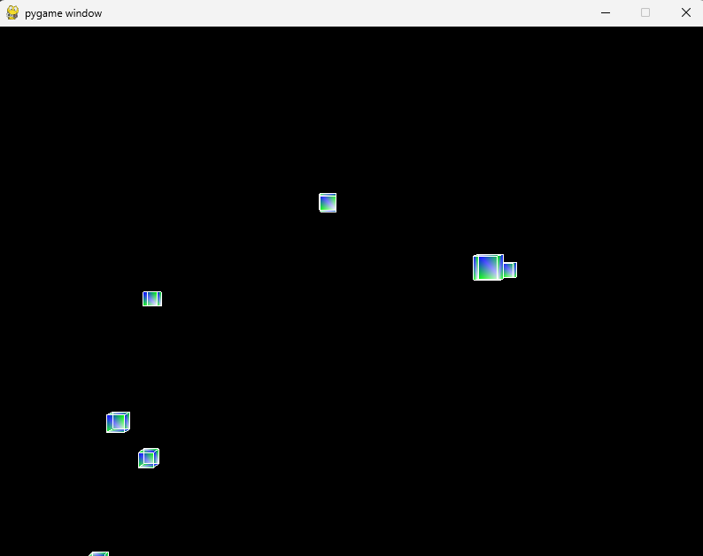
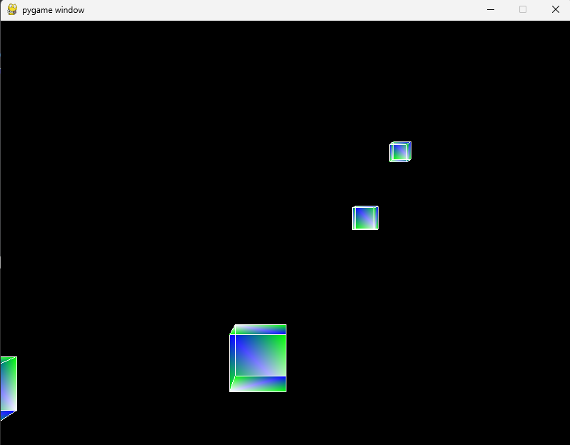

# Dynamic 3D Cube Visualizer

A real-time 3D visualization project built using **Python**, **Pygame**, and **PyOpenGL**. The application renders dozens of colored wireframe and solid cubes in a procedurally generated 3D space, creating the illusion of flying through an endless cube field.

Users can navigate through the environment using keyboard controls and zoom in or out using the mouse wheel. As cubes move behind the camera, they are automatically repositioned ahead of the viewer, producing a continuous and dynamic visualization.

## Project Preview

### Scene View 1



### Scene View 2



---

## Features

* Real-time 3D rendering using OpenGL
* Interactive camera movement
* Mouse wheel zoom functionality
* Randomized cube placement in 3D space
* Continuous environment generation
* Colored cube surfaces with wireframe edges
* Lightweight and easy-to-understand implementation
* Demonstrates core concepts of computer graphics and 3D transformations

---

## Technologies Used

| Technology | Purpose                            |
| ---------- | ---------------------------------- |
| Python     | Core programming language          |
| Pygame     | Window creation and event handling |
| PyOpenGL   | OpenGL bindings for Python         |
| OpenGL     | 3D rendering and transformations   |

---

## Installation

### 1. Clone the Repository

```bash
git clone https://github.com/your-username/dynamic-3d-cube-visualizer.git
cd dynamic-3d-cube-visualizer
```

### 2. Create a Virtual Environment (Optional)

```bash
python -m venv venv
```

Activate it:

**Windows**

```bash
venv\Scripts\activate
```

**Linux / macOS**

```bash
source venv/bin/activate
```

### 3. Install Dependencies

```bash
pip install pygame PyOpenGL PyOpenGL_accelerate
```

---

## Running the Project

Execute the Python script:

```bash
python base.py
```


---

## Controls

| Action     | Key              |
| ---------- | ---------------- |
| Move Left  | Left Arrow       |
| Move Right | Right Arrow      |
| Move Up    | Up Arrow         |
| Move Down  | Down Arrow       |
| Zoom In    | Mouse Wheel Up   |
| Zoom Out   | Mouse Wheel Down |
| Exit       | Close Window     |

---

## How It Works

### 1. Cube Geometry Definition

The program begins by defining:

* Cube vertices
* Edges
* Surfaces
* Face colors

These structures describe the shape and appearance of every cube rendered in the scene.

### 2. Procedural Cube Generation

The `set_vertices()` function generates cubes at random positions within a predefined distance range.

Each cube receives:

* Random X position
* Random Y position
* Random Z depth

This creates a scattered 3D environment.

### 3. OpenGL Perspective Setup

The application initializes a perspective projection using:

```python
gluPerspective(45, aspect_ratio, 0.1, max_distance)
```

This simulates a realistic camera view and depth perception.

### 4. Camera Navigation

User input updates camera translation values:

```python
glTranslatef(x_move, y_move, 0.40)
```

The forward movement continuously advances the camera through the scene.

### 5. Cube Rendering

Each frame:

* Cube surfaces are rendered using `GL_QUADS`
* Cube edges are rendered using `GL_LINES`

This creates colored cubes with visible wireframe boundaries.

### 6. Infinite Environment Effect

When a cube passes behind the camera, it is repositioned ahead of the viewer.

This recycling mechanism creates the illusion of an endless 3D world while maintaining a fixed number of cubes.

---

## OpenGL Concepts Demonstrated

This project demonstrates several fundamental computer graphics concepts:

* 3D coordinate systems
* Perspective projection
* Transformation matrices
* Camera movement
* Vertex rendering
* Wireframe rendering
* Depth perception
* Procedural scene generation
* Real-time rendering loops

---

## Project Structure

```text
Dynamic-3D-Cube-Visualizer/
│
├── base.py
├── README.md
│
└── images/
    ├── demo1.png
    └── demo2.png
```

---

## Educational Value

This project is useful for learning:

* OpenGL fundamentals
* Interactive graphics programming
* Pygame integration with OpenGL
* Real-time rendering pipelines
* 3D mathematical transformations
* Event-driven programming

It serves as a strong introductory project for students interested in computer graphics, game development, simulation systems, and visualization.

---

## Future Improvements

Possible extensions include:

* Cube rotation animations
* Lighting and shading effects
* Texture mapping
* Collision detection
* First-person camera controls
* Particle systems
* Dynamic color transitions
* GPU shader implementation
* Procedural terrain generation


